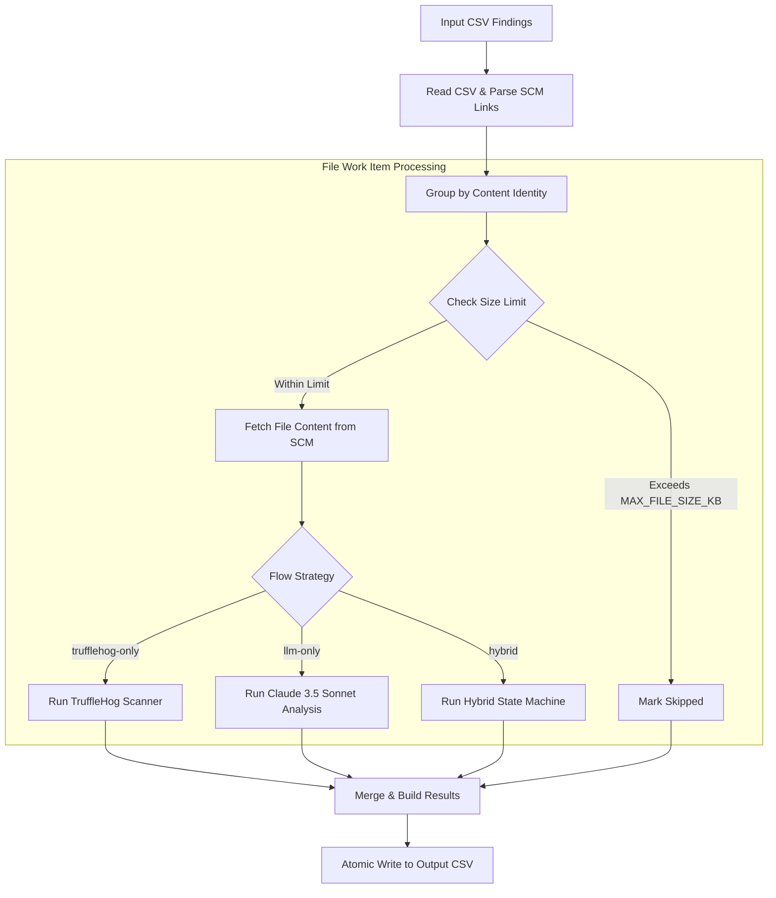
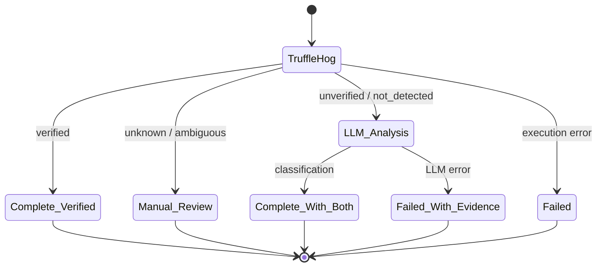

# Secret Reconciler (`secret-reconciler`)

> A high-throughput CLI tool that processes secret-scanner CSV finding exports, deduplicates source code fetches across GitHub and Azure DevOps, and classifies each finding using TruffleHog and/or Anthropic Claude.

---

## Table of Contents

- [Features](#features)
- [Architecture & Workflow](#architecture--workflow)
- [Prerequisites & Tool Setup](#prerequisites--tool-setup)
- [Installation & Quickstart](#installation--quickstart)
- [Environment Configuration](#environment-configuration)
- [Analysis Flows](#analysis-flows)
- [CLI Reference & Usage](#cli-reference--usage)
- [CSV Schemas](#csv-schemas)
  - [Input SCM Link Formats](#input-scm-link-formats)
  - [Output Columns & Values](#output-columns--values)
- [Operational Resilience & Edge Cases](#operational-resilience--edge-cases)
- [Development & Testing](#development--testing)

---

## Features

- ⚡ **Deduplicated Fetching via Content Identity**: Groups hundreds of findings across the same repository and commit SHA into single **File Work Items**, fetching each file only once.
- 🌐 **Multi-Provider SCM Support**: Direct REST API integration for both **GitHub** and **Azure DevOps** with exact 40-character commit revision pinning.
- 🧠 **Three Analysis Flows**:
  - `trufflehog-only`: High-speed local verification via TruffleHog CLI.
  - `llm-only`: Deep semantic analysis via Anthropic Claude 3.5 Sonnet to eliminate false positives (test fixtures, docs, dummy values).
  - `hybrid`: Verification-first analysis (TruffleHog always runs; the LLM is used only for `unverified` or `not_detected` findings).
- 🔄 **Output-as-Input Resume**: Directly re-feed an output CSV to resume interrupted jobs or retry failed rows without separate checkpoint files.
- 🛡️ **Graceful Cancellation**: Intercepts `SIGINT` / `SIGTERM` signals to finish in-flight requests and flush an uncorrupted CSV before exiting.
- 💰 **Cost & Token Tracking**: Real-time progress updates tracking input/output tokens and estimated USD expenditure.

---

## Architecture & Workflow

### 1. Pipeline Lifecycle



### 2. Hybrid Flow State Machine

In `hybrid` flow, TruffleHog owns credential detection and validity. Verified, verifier-error (`unknown`), and unsafe-correlation (`ambiguous`) results are terminal and never sent to the LLM. Only `unverified` and `not_detected` findings reach the LLM false-positive intelligence layer:



---

## Prerequisites & Tool Setup

### 1. Node.js

Requires **Node.js >= 20.0.0**.

```bash
# Verify your Node.js version
node --version

# If needed, install or switch using nvm / fnm
nvm install 20
nvm use 20
```

### 2. TruffleHog CLI

Required for `trufflehog-only` and `hybrid` flows. Version **3.97.0** must be available on your system `PATH`; the CLI checks this contract at startup and fails closed on a different version.

```bash
# Linux / macOS (pinned binary install)
curl -sSfL https://raw.githubusercontent.com/trufflesecurity/trufflehog/main/scripts/install.sh \
  | sudo sh -s -- -b /usr/local/bin v3.97.0

# Must report 3.97.0
trufflehog --version
```

### 3. API Keys & Token Scopes

| Provider | Variable | Required Permissions / Scopes |
| :--- | :--- | :--- |
| **GitHub** | `GITHUB_PAT` | Fine-grained PAT with **Contents: Read-only** on target repos, or Classic PAT with `repo` scope (for private repositories). |
| **Azure DevOps** | `AZURE_DEVOPS_PAT` | Personal Access Token with **Code (Read)** permission. |
| **Anthropic** | `ANTHROPIC_API_KEY` | Standard Anthropic API key with access to Claude 3.5 Sonnet (`claude-3-5-sonnet-20241022`). |

---

## Installation & Quickstart

```bash
# 1. Navigate to the secret-reconciler directory
cd secret-reconciler

# 2. Install dependencies
npm install

# 3. Create your local .env configuration
cp .env.example .env

# 4. Edit .env with your tokens and desired FLOW
nano .env

# 5. Run reconciliation on one or more CSVs
npm run dev -- ../path/to/findings.csv
```

---

## Environment Configuration

Configuration is loaded from `.env` (or ambient environment variables) and strictly validated on startup using **Zod**. If any variable is missing or invalid, the CLI exits immediately with a descriptive error.

| Environment Variable | Type | Default / Example | Required? | Description |
| :--- | :--- | :--- | :--- | :--- |
| `FLOW` | Enum | `hybrid` | **Yes** | Analysis flow: `trufflehog-only`, `llm-only`, or `hybrid`. |
| `ANTHROPIC_API_KEY` | String | `sk-ant-...` | **Yes** (LLM/Hybrid) | Anthropic API key. |
| `ANTHROPIC_MODEL` | String | `claude-3-5-sonnet-20241022` | **Yes** (LLM/Hybrid) | Claude model identifier. |
| `MAX_TOKENS_PER_REQUEST` | Integer | `4096` | **Yes** (LLM/Hybrid) | Maximum completion tokens per Claude request (>= 1). |
| `MAX_LLM_CALLS_PER_FILE` | Integer | `3` | **Yes** (LLM/Hybrid) | Maximum LLM batch calls per file work item (>= 1). |
| `GITHUB_PAT` | String | `ghp_...` | **Yes** | GitHub Personal Access Token. |
| `AZURE_DEVOPS_PAT` | String | `...` | *Optional* | Azure DevOps Personal Access Token (required if Azure links exist). |
| `TRUFFLEHOG_VERIFICATION_MODE` | Enum | `all` | *Optional* | Verification mode: `all` (default) or `no-verification`. `verified-only` is rejected because it discards evidence. |
| `TRUFFLEHOG_TIMEOUT_SECONDS` | Integer | `60` | *Optional* | Subprocess timeout for TruffleHog scans in seconds (>= 1, default `60`). |
| `TRUFFLEHOG_USER_AGENT_SUFFIX` | String | `...` | *Optional* | Custom suffix appended to TruffleHog outgoing verification HTTP requests. |
| `TRUFFLEHOG_CONFIG_PATH` | String | `/etc/trufflehog/custom.yaml` | *Optional* | YAML configuration containing custom TruffleHog detectors and verifiers. |
| `CHECK_IDS` | String | `CKV_SECRET_6,CKV_AWS_1` | *Optional* | Comma-separated list of Check IDs to reconcile (default: all). |
| `LIMIT` | Integer | `100` | *Optional* | Maximum number of pending findings to process in this run (>= 1, default: unlimited). |
| `CONCURRENCY` | Integer | `5` | **Yes** | Number of file work items processed concurrently (>= 1). |
| `MAX_FILE_SIZE_KB` | Integer | `500` | **Yes** | Maximum file size in KB to download and analyze (>= 1). |
| `SURROUNDING_LINES` | Integer | `10` | **Yes** | Lines of code context included above and below each finding (>= 0). |
| `CLEANUP_TEMP_FILES` | Boolean | `true` | **Yes** | Coerces `"true"` or `"false"`. Deletes downloaded source files on completion. |

---

## Analysis Flows

| Flow | Strengths | Ideal For | LLM Used? | Scanner Used? |
| :--- | :--- | :--- | :--- | :--- |
| **`hybrid`** *(Recommended)* | Preserves deterministic scanner evidence first, then adds semantic false-positive context only where needed. | Production scans containing thousands of mixed alerts. | ✅ (Conditional) | ✅ (Always) |
| **`llm-only`** | Best for understanding complex code context, documentation, mock tests, and template files. | Eliminating false positives where regex scanners trigger on test fixtures. | ✅ | ❌ |
| **`trufflehog-only`** | Ultra-fast, zero API cost, validates live detector endpoints. | Quick verification runs without external LLM dependencies. | ❌ | ✅ |

---

## CLI Reference & Usage

```bash
secret-reconciler [options] <csv...>
```

### Options

| Option | Flag | Description | Default |
| :--- | :--- | :--- | :--- |
| `--output` | `-o <path>` | Custom destination path for the reconciled output CSV. | `results-YYYYMMDDTHHMM.csv` |
| `--check-ids` | `<ids...>` | Filter findings by one or more Check IDs (comma or space separated). | `(all)` |
| `--limit` | `-n <count>` | Limit reconciliation to the first N pending findings. | `(unlimited)` |
| `--retry-failed` | *(boolean)* | Re-process rows previously marked with `status=failed`. | `false` |
| `--keep-files` | *(boolean)* | Prevent deletion of downloaded source files for manual inspection. | `false` |
| `--help` | `-h` | Display help screen and option descriptions. | — |
| `--version` | `-V` | Output version number. | `0.1.0` |

### Common Usage Examples

#### 1. Standard Single CSV Reconciliation
```bash
npm run dev -- ./data/github-findings.csv
```

#### 2. Filter by Specific Check IDs
Target only specific detection rules (e.g. `CKV_SECRET_6` or `CKV_AWS_1`), preserving all other rows in `pending` status:
```bash
npm run dev -- ./data/findings.csv --check-ids CKV_SECRET_6 CKV_AWS_1
```

#### 3. Bounded Batch Run (Finding Limit)
Process only the first 50 pending findings to save tokens or test configuration changes:
```bash
npm run dev -- ./data/findings.csv -n 50
```

#### 4. Combined Filter and Limit
Apply Check ID filtering first, then bound to a batch of 100 matching findings:
```bash
npm run dev -- ./data/findings.csv --check-ids CKV_SECRET_6 -n 100 -o ./batch-ckv6.csv
```

#### 5. Multi-CSV Merge Run
Processes multiple scanner exports (e.g. GitHub and Azure DevOps), unifies all columns, and records original filenames in `source_file`:
```bash
npm run dev -- ./data/github-findings.csv ./data/ado-findings.csv -o ./reconciled-all.csv
```

#### 6. Resume an Interrupted Job
If a previous run was stopped or partially processed, simply pass the generated output CSV back as input. Completed rows will be skipped automatically:
```bash
npm run dev -- ./reconciled-all.csv -o ./reconciled-all.csv
```

#### 7. Retry Failed Rows
To re-attempt network errors, API timeouts, or rate limits for failed rows:
```bash
npm run dev -- ./reconciled-all.csv --retry-failed -o ./reconciled-all.csv
```

#### 8. Debugging & File Retention
Retain downloaded files in the operating system temp directory to inspect exact file content:
```bash
npm run dev -- ./data/findings.csv --keep-files
```

#### 6. Offline Scanning (No Network Verification)
Run fast offline scans without making live verification API calls to external third-party services:
```bash
# In .env:
# TRUFFLEHOG_VERIFICATION_MODE=no-verification
npm run dev -- ./data/findings.csv
```

#### 7. Audit Attribution & Timeout Control
Attach a custom audit tracking string to TruffleHog verification requests and give slow scans extra time:
```bash
# In .env:
# TRUFFLEHOG_USER_AGENT_SUFFIX=SecurityAuditTeam-2026
# TRUFFLEHOG_TIMEOUT_SECONDS=120
npm run dev -- ./data/findings.csv
```

---

## CSV Schemas

### Input SCM Link Formats

The reconciler auto-detects the SCM link column by checking header variations: `scmlink`, `scmlinkurl`, `scmurl`, `sourcelink`, `repolink`, `url`, or `link`.

#### Supported URL Patterns

- **GitHub Blob URLs**:
  ```text
  https://github.com/{org}/{repo}/blob/{40-char-commit-sha}/{file-path}#L{start}[-L{end}]
  ```
  *Example*: `https://github.com/octocat/hello-world/blob/7fd1a60b01f91b314f59955a4e4d4e80d8edf11d/src/config.json#L12-L14`

- **Azure DevOps Git URLs**:
  ```text
  https://dev.azure.com/{org}/{project}/_git/{repo}?path={filePath}&version=GC{40-char-commit-sha}&line={start}&lineEnd={end}
  ```
  *Example*: `https://dev.azure.com/myorg/myproject/_git/backend-service?path=/secrets/auth.py&version=GCa1b2c3d4e5f6a1b2c3d4e5f6a1b2c3d4e5f6a1b2&line=45&lineEnd=47`

> [!NOTE]
> SCM links must reference a full **40-character commit SHA**. Branch references (e.g. `/blob/main/...`) are rejected to avoid scanning the wrong revision.

---

### Output Columns & Values

The output CSV preserves **all original input columns** verbatim and appends 8 reconciliation columns:

| Output Column | Type | Example Values | Description |
| :--- | :--- | :--- | :--- |
| `source_file` | String | `github-findings.csv` | Original input CSV file name where the finding originated. |
| `status` | Enum | `completed`, `failed`, `skipped`, `pending` | Final processing status of the finding. |
| `trufflehog_result` | Enum | `verified`, `unverified`, `unknown`, `not_detected`, `ambiguous`, `""` | Lossless TruffleHog outcome for the finding's line range. |
| `trufflehog_detector` | String | `AWS`, `SlackWebhook`, `GenericKey` | TruffleHog detector type if a secret was detected. |
| `llm_classification` | Enum | `false_positive`, `likely_secret`, `uncertain`, `llm_invalid_output` | Semantic classification from Claude 3.5 Sonnet. |
| `llm_reason` | String | `"Variable is a mock test token in fixture"` | Brief explanation generated by the LLM. |
| `llm_confidence` | Float | `0.95` | Confidence score between `0.0` and `1.0`. |
| `error` | String | `""`, `File size (650 KB) exceeds limit` | Error or skip reason if not completed. |

#### Status & Classification Value Dictionary

- **`status`**:
  - `completed`: Successfully analyzed by the configured flow.
  - `failed`: Network fetch failed, scanner error, or unrecoverable LLM error.
  - `skipped`: Unparseable SCM URL or file size exceeded `MAX_FILE_SIZE_KB`.
  - `pending`: Unfinished row from an interrupted run.
- **`trufflehog_result`**:
  - `verified`: Secret was confirmed active/live by TruffleHog detector.
  - `unverified`: Secret signature matched, but was not verified as active (or verification was disabled).
  - `unknown`: Verification was attempted but could not complete because of an operational error.
  - `not_detected`: Scanner completed and no detection overlapped the specified lines.
  - `ambiguous`: Detection evidence exists, but missing or overlapping location metadata prevents a safe one-to-one match.
- **`llm_classification`**:
  - `false_positive`: Code analysis indicates dummy, example, or invalid secret.
  - `likely_secret`: Context indicates real credentials, tokens, or private keys.
  - `uncertain`: Insufficient surrounding context to determine validity.

---

## Operational Resilience & Edge Cases

### 1. Graceful Shutdown (`SIGINT` / `SIGTERM`)
When you press `Ctrl+C`:
- **Single Press**: The CLI immediately stops dequeuing new files, waits for active in-flight fetch/LLM requests to complete, flushes the current progress to the output CSV with `status=pending` for unfinished rows, and exits cleanly with exit code `130`.
- **Double Press**: Forces immediate process exit.

### 2. Atomic Writes
Output files are written using a temporary sibling file (`<output>.tmp.<pid>.<timestamp>`) and atomically renamed to prevent file corruption during sudden terminations.

### 3. File Size Caps (`MAX_FILE_SIZE_KB`)
Files exceeding `MAX_FILE_SIZE_KB` (default 500 KB) are automatically marked with `status=skipped` and `error="File size (X KB) exceeds maximum allowed size (Y KB)"` to prevent memory exhaustion and excessive LLM token costs.

### 4. Large Finding Batching
Files with more than 15 findings are automatically partitioned into batches of 15. The CLI enforces `MAX_LLM_CALLS_PER_FILE` to safeguard against runaway API calls on heavily flagged files.

---

## Development & Testing

### Running the Test Suite

The test suite uses [Vitest](https://vitest.dev/) with 100% unit and integration test coverage across all parsers, fetchers, CSV reader/writers, and flow state machines.

```bash
# Run all tests
npm test

# Run tests in watch mode
npm run test:watch

# Run a specific test suite
npm test -- src/__tests__/integration-hybrid.test.ts

# TypeScript typechecking
npm run typecheck

# Exercise the adapter against the real pinned TruffleHog binary
npm run test:trufflehog-contract
```

### Module Overview

- `src/parsers/`: Discriminated union URL parsers for GitHub and Azure DevOps SCM links.
- `src/fetcher/`: Multi-provider file downloader with concurrency control and size checks.
- `src/llm/`: Claude client wrapper, prompt template builder, surrounding context extractor, and token cost calculator.
- `src/trufflehog/`: Filesystem scanner executor and line-overlap matching algorithms.
- `src/hybrid/`: Pure transition function state machine governing Hybrid flow execution.
- `src/csv/`: Streaming CSV reader with fuzzy header discovery and atomic CSV writer.
- `src/pipeline.ts`: Central orchestration pipeline.
- `src/index.ts`: Commander.js CLI entrypoint.
